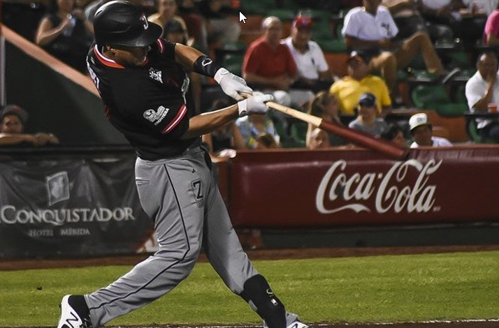

# About Me

Welcome to my GitHub repository! I'm excited to have you here. I'd like to take a moment to introduce myself and share a bit about my journey.

First off, I proudly wore the University of Southern California Trojans jersey and spent over a decade as a professional baseball player. Those years were filled with incredible moments, lasting friendships, and lessons that shaped who I am today. But life is all about chapters, and after a successful baseball career, I found myself pondering what would come next.  I did have a degree from USC in Policy, Planning, and Development, but I wasn't conviced it was what I wanted to do after baseball.

Back in 2008, the Los Angeles Angels of Anaheim drafted me from USC. The first years as a professional baseball player, the baseball field was my main stage, but the off-season was a different story. It wasn't easy to find work during those months, but I embraced the challenge. I learned that real accomplishments don't come without hurdles, and I was determined to overcome them.

Fast forward through 13 amazing years in baseball, and a truly magical thing occurred. My childhood friend, who also happened to be my ***childhood crush***, reentered my life. With her unwavering support and motivation, I made a life-altering decision to pursue my passion for technology.  For the last three years of my professional baseball career, I enrolled back to school and, through online classes, attained my second Bachelor's degree.

Imagine this: while my teammates celebrated after games and partied, I remained committed to my studies. Those late nights on the team bus became opportunities for deep dives into my education. I traded instant gratification for the promise of long-term success. The journey demanded everything I had, pushing me physically and mentally. But I assure you, every ounce of effort was worth it.

Now armed with a second Bachelor’s degree in Information Technology, I've transitioned seamlessly from baseball to the world of IT. I've earned certifications like CompTIA Network+, Security+, and the Cisco Certified Network Associate (CCNA), which have further honed my expertise.

While I might be relatively new to the IT scene, the energy and discipline I cultivated during my baseball years have fueled my thirst for knowledge. More than personal growth, my passion lies in making a positive impact on others.

Through this blog, I'm excited to share valuable insights, personal stories, and practical tips to help you navigate the world of technology and achieve your career goals. Join me as we venture into this exciting realm together.

Thank you for dropping by, and I hope my content inspires and enlightens you. Here's to growth and new beginnings!