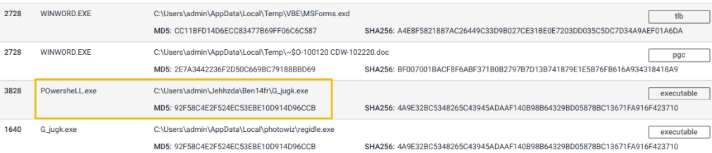

# Piramid of Pain

This is a fairly new concept being applied by reputable companies with the goal of improving the effectiveness of Cyber Threat Intelligence (CTI), threat hunding, and Incident Response (IR)

Check out these resources for a general overview of its meaning, and how reputable companies are implementing it:

[Cisco Security](https://gblogs.cisco.com/ca/2020/08/26/the-canadian-bacon-cisco-security-and-the-pyramid-of-pain/)

[SentinelOne](https://www.sentinelone.com/blog/revisiting-the-pyramid-of-pain-leveraging-edr-data-to-improve-cyber-threat-intelligence/)

[SOCRadar](https://socradar.io/re-examining-the-pyramid-of-pain-to-use-cyber-threat-intelligence-more-effectively/)

## Hash Values (Trivial)

**Zone:** Blue (Trivial)

**Hash Value** - this is a fixed length numeric value that identifies a piece of data. This is possible through hashing algorigthms. 

**MD5 (Message Digest, RFC 1321)**

  - Designed by Ron Rivest, 1992
  - **128-bit** hash value
  - **Are NOT considered SECURE**
  - RFC 6151 - published attacks agains MD5 hashes (i.e. hash collision)

**SHA-1 (Secure Hash Algorithm 1, RFC 3174)**

  - Invented by National Security Agency (NSA) in 1995
  - **160-bit** hash value as a 40 digit hex number
  - Was deprecated by NIST in 2011 - susceptible by brute force attacks

**SHA-2 (Secure Hash Algorithm 2)**

  - Designed by NIST and NSA in 2001
  - Most common variants is **SHA-256** - returns a **256-bit** hash value as 64 digit hex number. 

Technically, two pieces of data could hash to the same hash value, but this is not considered cryptographically secure.  

Because altering a file by even a single bit could produce an entirely different hash value, this could become very difficult to analyze as a threat hunter.  Because of the hash value produced by hashing algorithms and how they can differ greatly by altering a single bit, its purpose is mainly used to ensure the integrity of files. 

### How to get the hash value of a file or Directory

When threat hunting, you'll run into situations where you must retrieve the hash value of a file to check for its integrity. To do this, we use the `Get-FileHash` command.  For example, if trying to get the file hash or `write.exe`, navigate to the directory where the file is located from powershell and type:

```ps
Get-FileHash .\write.exe
```

If you're trying to get every hash value of the files within a directory, you can use the `*` wildcard in the path parameter, like so:

```ps
Get-FileHash .\*.exe
```

By default, Windows will generate the hash value using the `SHA256` hashing algorithm, but you can specify which algorithm to use with the `-Algorithm` or `-a` options. 

```ps
Get-FileHash 'C:\Program Files\Notepad++\notepad++.exe' -Algorithm SHA384
```

Now, for attackers, the method of modifying a hash value is trivial, as you will see with this example.  Here's the MD5 hash value of a file, and for easier viewing, I've piped it to `Format-List` so it lists the result in a list format. 

```ps
PS C:\Test> Get-FileHash .\SomeFile.txt -Algorithm MD5 | Format-List


Algorithm : MD5
Hash      : 4298DF4E98CF0FEED4F511F8E67DC0EB
Path      : C:\Test\SomeFile.txt
```

Using the `AppendToHash` text and using the `>>` operator, we redirect the text and append it to the output of the original file. Afterwards, we get the MD5 hash value once again and notice we get an entirely different value. 

```ps
PS C:\Test> echo "AppendToHash" >> .\SomeFile.txt
PS C:\Test> Get-FileHash .\SomeFile.txt -Algorithm MD5 | Format-List


Algorithm : MD5
Hash      : 0F1DD50C559BCE6F35791F9E6495599D
Path      : C:\Test\SomeFile.txt
```

## IP Address (Easy)

- **Zone:** Green (easy)
- **IP Address:** Identifies devices on a network like desktops, servers, and cameras.
- **Sending and Receiving Data:** IP addresses are essential for transmitting data over a network.
- **Pyramid of Pain:** IP addresses are a green-level indicator, indicating their significance.

### Defense Perspective

- **Blocking IP Addresses:** A common defense tactic to prevent incoming requests from certain IPs.
- **Limitations:** This tactic isn't foolproof; experienced adversaries can easily switch to new IPs.
- **Challenge - Fast Flux:** Adversaries use techniques like Fast Flux to evade IP blocking.

### Fast Flux Technique

- **DNS Technique:** Used by botnets to hide malicious activities behind compromised hosts.
- **Purpose:** Concealing communication between malware and its command server.
- **Dynamic IP Association:** Multiple changing IPs associated with a domain name.
- **Akamai's Definition:** Fast Flux makes malware communication hard to detect.
- **Example:** Palo Alto's fictional scenario explains Fast Flux's resilience.


## Domain Names (Simple)

**Zone:** Teal (Simple)

This section talks about the significance of domain names in the context of cybersecurity. Let's break down the key points:

### Domain Names - Simplified

- **Mapping to IP Addresses:** Domain names link to IP addresses, allowing users to access websites using text-based URLs. 
- **Structure:** Domain names can consist of a domain and top-level domain (e.g., evilcorp.com) or sub-domain, domain, and top-level domain (e.g., tryhackme.evilcorp.com).
- **Impact on Attackers and Defenders:** Changing domain names can be more cumbersome for attackers, involving purchasing, registering, and modifying DNS records. However, some loose standards and APIs make it easier for attackers to manipulate domains.

Although it can be harder for attackers to deal with Domain Names seeing that they would have to purchase, register, and modify a domain and its DNS records, DNS providers still provide APIs, which make it easier for attackers to change domains. 

### Punycode Attacks

**Punycode**

  - A method to encode non-ASCII characters into ASCII-compatible format.  
  - Its main purpose is to try and deceipt the human eye (obfuscation)
  - i.e. `adıdas.de` has a Punycode of `http://xn--addas-o4a.de/`

**Punycode Attacks**

  - Attackers use Punycode to create URLs that look legitimate but redirect users to malicious domains.

**Detection**

  - Modern browsers can translate obfuscated characters into Punycode, helping users identify such attacks.

**Malicious URL Shorteners**

  - Attackers hide malicious domains behind URL shortening services like bit.ly, goo.gl, etc.

**Detecting Malicious URLs**

  - Proxy logs or web server logs can help identify connections to malicious domains.
  - Examples of **URL Shortening services**:
    - bit.ly
    - goo.gl
    - ow.ly
    - s.id
    - smarturl.it
    - tiny.pl
    - tinyurl.com
    - x.co

### Analyzing Connections in Any.run

**Any.run Sandbox:** 

- Analyzing samples by executing them in a controlled environment.
  
**Monitoring Connections:**

- Any.run provides insight into HTTP requests, DNS requests, and communication processes.

**HTTP Requests:** 

- Shows resources retrieved from a webserver, like droppers or callbacks.

**Connections:** 

- Reveals communications between processes, such as C2 (Command and Control) traffic or file transfers.


**DNS Requests:** 

- Displays DNS requests made by malware to check internet connectivity.

Remember, these insights help defenders better understand the tactics attackers use, empowering us to stay vigilant and proactive in the ever-evolving landscape of cybersecurity.


## Host Artifacts (Annoying)

- **Zone:** Yellow (annoying)
- Moving to the yellow zone intensifies detection, making attackers feel annoyed.
- Enhanced detection requires attackers to adjust their tools/methodologies, wasting their time and resources.
- **"Host artifacts"** are the signs attackers leave behind:
  - Registry changes
  - Suspicious processes
  - Attack patterns or IOCs
  - Malicious files dropped
  - Unique threat indicators.

**Suspicious process execution from Word:**


**Suspicious events followed by opening a malicious application:**


**Files modified/dropped by malicioius actor:**


## Network Artifacts (Annoying)**

*As we progress up the pyramid, we're essentially ramping up the difficulty for attackers, enhancing our detection odds.*

- **Zone:** Dark Yellow (annoying).
- **Impact on Attacker:** Requires more time to adjust tactics/tools when detected, affording defenders added response and remediation time.
  
- **Definition:** Network artifacts.
  - Examples: User-agent strings, C2 info, URI patterns from HTTP POST requests.
  - Noteworthy: A unique or unfamiliar User-Agent string can signal a potential threat.
  - User-Agent: Per RFC2616, it's the request-header field indicating the user agent behind the request.
  
- **Detection:** 
  - Through Wireshark PCAPs.
  - Using network protocol analyzers like TShark or IDS logs from sources like Snort.

- **Practical Application:** 

  - To filter User-Agent strings with TShark: 
    ```ps
    tshark --Y http.request -T fields -e http.host -e http.user_agent -r analysis_file.pcap
    ```
    
    The given command is used to analyze network traffic. Here's a breakdown:

      - **`tshark`**: This is the command-line version of Wireshark, a popular network protocol analyzer.
      - **`--Y http.request`**: This filters the captured traffic to only show HTTP requests. The `--Y` flag indicates a display filter is being used.
      - **`-T fields`**: This option specifies that the output should be formatted as fields, which makes it easier to see specific details.
      - **`-e http.host`** and **`-e http.user_agent`**: These are field options that indicate which specific fields you want to display in the output. In this case, you're interested in:
        - `http.host`: The host name or IP address of the server.
        - `http.user_agent`: The User-Agent string, which provides information about the client (e.g., browser or tool) making the request.
      - **`-r analysis_file.pcap`**: This option specifies that `tshark` should read from the file `analysis_file.pcap`, which is a packet capture file.

In simple terms, this command reads the specified packet capture file (`analysis_file.pcap`), filters for HTTP requests, and then displays the host and User-Agent fields for each request. This can be useful for analyzing the sources of web requests and the tools or browsers that made them.

- Key Example: Common User-Agent strings are associated with the [Emotet Downloader Trojan](https://www.mcafee.com/blogs/other-blogs/mcafee-labs/emotet-downloader-trojan-returns-in-force/).
  
- **Defensive Strategy:** Identifying custom User-Agent strings used by attackers can lead to effective blocks, further hampering their intrusion efforts.

